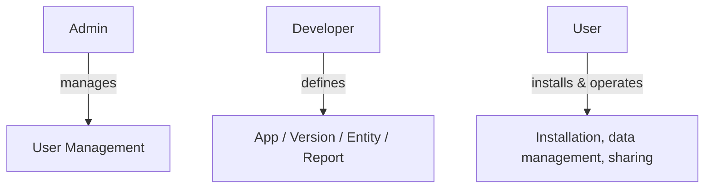
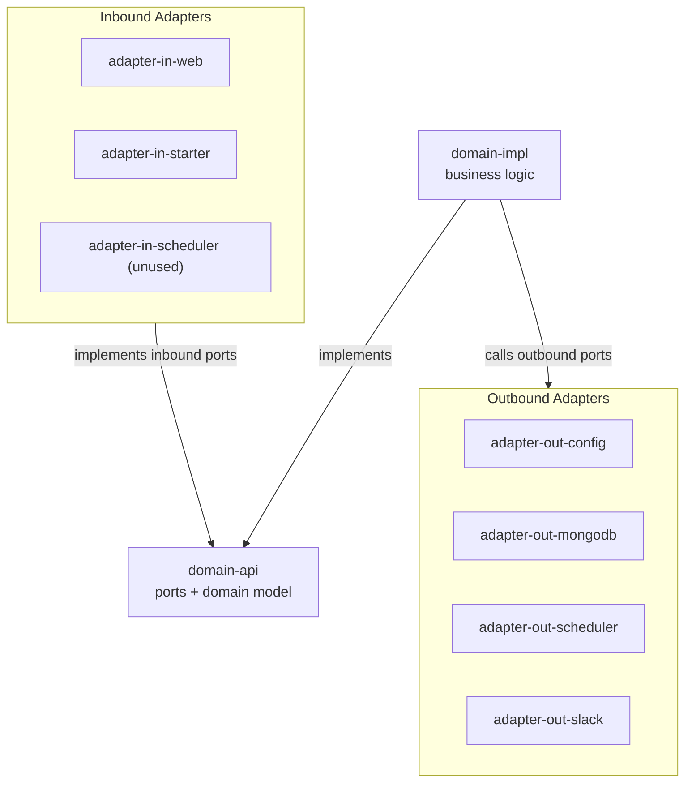
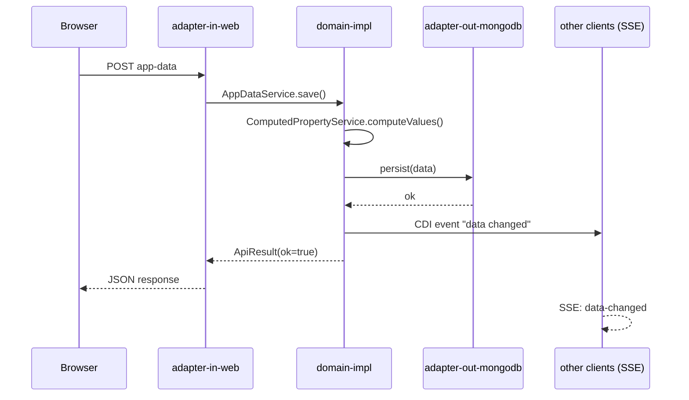
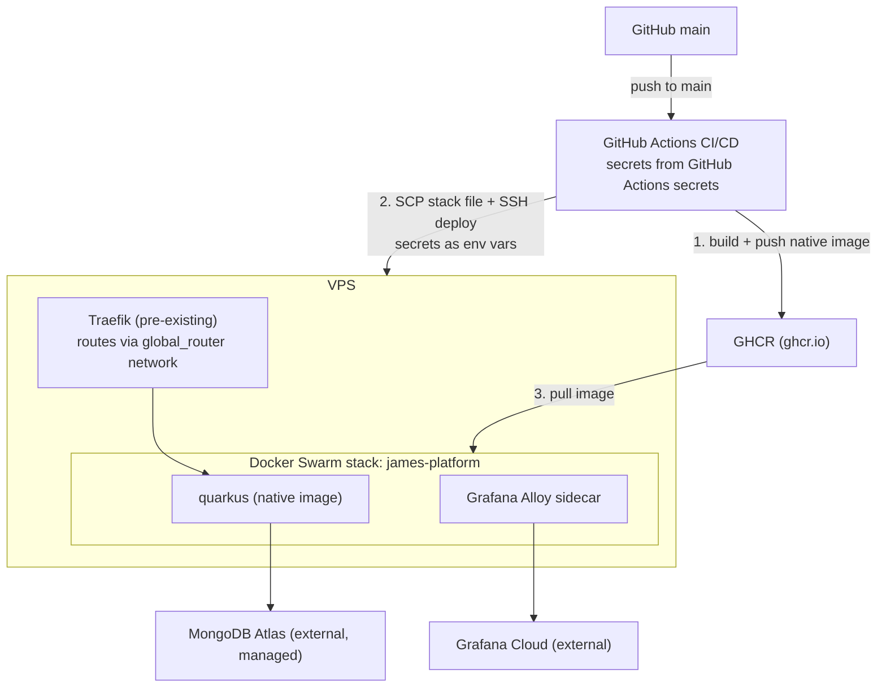

# james-platform

# Introduction and Goals

## Requirements Overview

James Platform is a personal Low Code system for building and running data-centric apps without writing boilerplate infrastructure code.

### Roles

| Role       | Description                                                                                         |
|------------|-----------------------------------------------------------------------------------------------------|
| Admin      | Platform administrator. Manages users. Cannot be a User or Developer at the same time.             |
| Developer  | Creates and maintains Apps. Defines entities, properties, and reports.                              |
| User       | Installs and uses App Versions. Enters, edits, deletes, and views data through the generic UI.     |
| Monitoring | Access to the Tools menu (health, config, logs, metrics, MongoDB viewer). Can be combined with other roles. |

### User Management

- Self-registration is not supported; only an Admin can register new accounts.
- An Admin can: register users, delete accounts, block/unblock accounts, reset passwords.
- Every account has a unique username, a bcrypt password hash, and one or more roles.

### Apps and Versions

- A Developer creates an **App** and publishes it as a series of **Versions**.
- Each Version carries a **semver** number derived automatically from entity changes:
  - *Breaking change* (removed/renamed entity or property, changed immutable ID) → mandatory **Major** release.
  - *Non-breaking change* → Developer chooses between **Feature** or **Bugfix** release.
  - The version number is never entered manually.
- A released Version records a release date and release notes.

### Entities and Properties

- A Version defines **Entities** and **Reports**.
- An Entity has:
  - A name unique within the App.
  - A globally unique internal ID (immutable).
  - An ordered list of **Properties**.
  - An optional **display text template** – a string that interpolates property values (e.g. `{firstName} {lastName}`) into a human-readable label shown for each object in list views and `ref` pickers, instead of a raw ID.
- A Property has:
  - A name unique within the Entity (mutable).
  - An ID unique within the Entity (immutable).
  - A data type and associated constraints.
  - An optional static **default** value, and/or a **smart default** (see below).
  - Optional **value proposals** – a Developer-configured list of suggested values offered to the User as autocomplete options in the create/edit form.
  - For `object` properties: a nested list of Properties, which may themselves be `object` properties (arbitrary nesting depth).
  - For `List` properties: an item type (any type except `List`) and, optionally, item-level constraints.
- **Computed properties** – a Developer may define derived properties by providing a Kotlin script that computes the value based on the entity's other properties. Computed properties may depend on each other; the definition order determines the evaluation sequence. Scripts run backend-side via the JSR-223 Kotlin scripting engine, each on its own virtual thread with a configurable timeout (`app.script.timeout-ms`, default 500ms); a timed-out or failing script yields `null` for that property without failing the surrounding request. There is no deeper sandboxing (no memory/IO isolation) beyond the timeout — see ADR [0008](../adr/0008-computed-property-script-execution.md).
- **Smart defaults** – like a static default, but computed by a Kotlin script (same execution model, engine, and timeout as computed properties) when the create form is opened, seeded with any static defaults already set on the entity. Unlike computed properties, a smart default is only a starting value — the User may freely overwrite it before saving, and it is not re-evaluated afterwards.

### Supported Data Types

| Type       | Description                                                                                           |
|------------|-------------------------------------------------------------------------------------------------------|
| `long`     | 64-bit integer                                                                                        |
| `Double`   | 64-bit floating-point                                                                                 |
| `boolean`  | True/false                                                                                            |
| `String`   | Text                                                                                                  |
| `date`     | Calendar date                                                                                         |
| `time`     | Time of day                                                                                           |
| `datetime` | Combined date and time                                                                                |
| `ref`      | Reference to an object of the same or another Entity within the same App Version                      |
| `duration` | A span of time (`java.time.Duration`)                                                                 |
| `List`     | Ordered list of any type except `List`                                                                |
| `object`   | Inline nested object with its own property list (analogous to an anonymous Entity without a global ID) |

Cyclic reference graphs via `ref` are detected and rejected at schema-definition time.

### Constraints

| Constraint   | Applies to    | Description                                                     |
|--------------|---------------|-----------------------------------------------------------------|
| `NOT NULL`   | all types     | Value must be present                                           |
| `UNIQUE KEY` | all types     | All values across all objects of this Entity must be distinct (not applicable to `List`/`object`) |

Additional per-type constraints are supported: `min`/`max`/`step` for `long` and `Double`; `min`/`max` length and a regex `pattern` for `String`; `min`/`max` for `date`, `time`, `datetime`, and `duration`; `min`/`max` size for `List`. `List` items may carry their own item-level constraints (all of the above except `UNIQUE KEY`).

### Generic User Interface

- **List view** – shows all objects of an Entity; supports deletion, sorting by any column, and user-defined sort parameters. A Developer may configure default sort parameters; the User may override them at runtime.
- **Create / Edit form** – generated automatically from the Entity definition. Three create modes are supported: single-object creation, **Focus** mode (carries values from the previous object forward as defaults for the next one), and **Snapshot** mode (captures the current form state as a reusable template that can be replaced or deleted).

### Data Sharing

A User can invite another User to share the data of an installed App Version.
The shared installation is treated as a separate installation. Supported sharing modes:

| Mode                | Description                                                                          |
|---------------------|--------------------------------------------------------------------------------------|
| Full sharing        | All participants can read, write, and delete all objects.                            |
| Read-all / Edit-own | All participants can see all objects; each can only modify their own.                |

### Reports

**Status: domain model only (`Report`, `Page` in `domain-api`) — no web adapter, endpoint, or UI exists yet.** The rest of this subsection describes the intended design, not current behavior:

- A Report belongs to one App and has a unique name within that App.
- A Report contains at least one **Page**; each Page provides HTML markup and JavaScript logic.
- A Report may declare which entities to load and may define per-Entity filter expressions.
- A set of built-in helper functions (charts, aggregation, date handling, …) is available to every Report; this code is maintained as part of the platform and is not user-supplied.
- A Report may only access data from its own App installation (sandbox boundary).
- The platform must prevent Developers from embedding malicious code in Reports (concept to be finalised — see the sandboxing trade-off already accepted for computed properties in ADR [0008](../adr/0008-computed-property-script-execution.md), which Reports will likely need to revisit given Reports execute in the browser, not backend-side).

## Quality Goals

| Priority | Quality Goal     | Motivation                                                                                    |
|----------|------------------|-----------------------------------------------------------------------------------------------|
| 1        | Correctness      | Entity schema constraints and cyclic-reference detection must be enforced without exception.  |
| 2        | Security         | Role-based access control, cookie security, and Report sandboxing protect user data.          |
| 3        | Developer UX     | App and schema creation must feel lightweight; no boilerplate for common CRUD patterns.       |
| 4        | Reliability      | External operations (e.g. notifications) are delivered on a best-effort basis.                |
| 5        | Maintainability  | Hexagonal architecture and clear module boundaries keep the codebase understandable.          |

# Architecture Constraints

| Constraint                          | Rationale                                                                                                 |
|-------------------------------------|-----------------------------------------------------------------------------------------------------------|
| Single developer / hobby project    | Low operational overhead is paramount; no team conventions, no enterprise tooling.                       |
| No self-registration                | The platform is invite-only; all accounts are created by an Admin.                                       |
| No separate frontend deployment     | Qute SSR keeps the stack simple; no npm/Node.js build step.                                              |
| VPS + Docker Swarm deployment       | The platform runs on an existing personal VPS; no Kubernetes or cloud-managed container orchestration.   |
| MongoDB Atlas as data store         | Flexible document model suits dynamic entity schemas; cloud-managed removes operational burden.           |
| Reports must be sandboxed           | Developers must not be able to inject code that accesses data outside their own App installation.         |
| Version numbers are never manual    | Semver is derived automatically from schema changes to guarantee semantic accuracy.                      |
| No cyclic entity references         | Cycle detection is enforced at schema-definition time to prevent infinite loops during data traversal.    |

# Context and Scope

## Business Context

James Platform is a personal Low Code system. Its primary purpose is to let a single Developer define data models (Entities) and user-facing views (Reports), then let Users install and operate those App Versions to manage their own data – all without writing infrastructure code.



**External actors:**

| Actor     | Interaction                                                              |
|-----------|--------------------------------------------------------------------------|
| Admin     | Registers, blocks, resets passwords for, and deletes user accounts       |
| Developer | Creates Apps, Versions, Entities (with properties), and Reports          |
| User      | Installs App Versions, manages objects via generic UI, shares data        |

## Technical Context

| Component          | Technology                     | Notes                                                         |
|--------------------|--------------------------------|---------------------------------------------------------------|
| Backend            | Quarkus (Kotlin, JVM / native) | Hexagonal architecture; all business logic in `domain-impl`   |
| Templating         | Qute (Quarkus SSR)             | Server-side rendering; no separate frontend project           |
| Database           | MongoDB Atlas                  | Document model for dynamic entity schemas                     |
| Authentication     | Cookie-based (AES session)     | Bcrypt password hashing; role-enforced via `QuarkusIdentity`  |
| Reverse proxy      | Traefik                        | TLS termination, HTTPS, on existing VPS                       |
| CI/CD              | GitHub Actions                 | Build, test, native Docker image, deploy to Docker Swarm      |

# Solution Strategy

| Goal              | Design decision                                                                                                    |
|-------------------|--------------------------------------------------------------------------------------------------------------------|
| Correctness       | Constraint validation and cyclic-reference detection in the domain layer; enforced before any persistence write.   |
| Security          | Role-based access via `QuarkusSecurityIdentity`; `HttpOnly` AES session cookie; computed-property scripts run with a timeout guard only, no deeper sandbox (Report sandboxing still a concept, see [Reports](#reports)). |
| Developer UX      | Generic CRUD UI generated from Entity metadata; semver auto-derived; no boilerplate for common patterns.           |
| Reliability       | External operations (notifications, …) are delivered on a best-effort basis.                                       |
| Maintainability   | Hexagonal architecture with strict module-dependency rules; zero infrastructure in `domain-api` / `domain-impl`.   |
| Flexible schemas  | MongoDB document model maps naturally to dynamic Entity/Property definitions.                                      |
| Simple deployment | Quarkus native Docker image + Docker Swarm on existing VPS; MongoDB Atlas as managed database.                     |

# Building Block View

## Whitebox Overall System

The system follows a hexagonal (ports & adapters) architecture, see ADR
[0002](../adr/0002-backend-hexagonal-architecture.md). `domain-api` and `domain-impl` contain
all business logic and are free of infrastructure dependencies; every inbound and outbound
integration lives in its own `adapter-*` module and depends inward on `domain-api` only. A
per-module dependency graph is generated on every build via the `dev.iurysouza.modulegraph`
Gradle plugin into `build/reports/modulegraph/modules.md` — regenerate it for the precise,
always-current picture; the diagram below is a simplified, hand-maintained overview of the
dependency direction only.



`application-quarkus` wires all of the above together (CDI, configuration, tests).

### Module Overview

Base package: `de.chrgroth.james.platform`

| Module                | Direction  | Responsibility                                                                        |
|-----------------------|------------|---------------------------------------------------------------------------------------|
| `domain-api`          | –          | Ports (interfaces) and domain model only – zero infrastructure                        |
| `domain-impl`         | –          | Business logic implementing the inbound port interfaces                               |
| `adapter-in-web`      | inbound    | HTTP endpoints, Qute SSR templates, SSE adapters, cookie auth mechanism               |
| `adapter-in-starter`  | inbound    | One-time startup beans (starters) for data migrations and one-time bugfixes           |
| `adapter-in-scheduler` | inbound   | Wired with the Quarkus scheduler extension; currently unused — no `@Scheduled` job exists yet, reserved for future use |
| `adapter-out-config`  | outbound   | Reads Quarkus/MicroProfile config and environment variables for health/config display |
| `adapter-out-mongodb` | outbound   | MongoDB persistence: user repository, MongoDB viewer, stats adapter                  |
| `adapter-out-scheduler` | outbound | Reads Quarkus scheduler metadata for health/cronjob display                          |
| `adapter-out-slack`   | outbound   | Slack notification adapter                                                            |
| `application-quarkus` | –          | Wiring only: CDI, configuration, integration tests                                   |

Note: a `core` module also exists in the repository (`Errors.kt`, `Utils.kt`, pre-dating the
current hexagonal structure) but is **not** included in `settings.gradle.kts` and is not part
of the build — dead weight left over from an earlier project iteration, not a real module.

### External Dependencies

Two of Chris's own projects, both hosted as GitHub Packages (Maven repositories declared in
`settings.gradle.kts`, resolved with a `GHCR_PAT`/`GITHUB_ACTOR` credential):

- [christiangroth/quarkus-one-time-starters](https://github.com/christiangroth/quarkus-one-time-starters) — runtime dependency, three artifacts:
  - `domain-api` – contracts: `Starter`, `StarterSkipPredicate`, `StarterCompletionFlag`
  - `domain-impl` – execution orchestration and startup observer
  - `adapter-out-persistence-mongodb` – MongoDB persistence for starter execution state
- [christiangroth/gradle-release-notes-plugin](https://github.com/christiangroth/gradle-release-notes-plugin) — build-time Gradle plugin (`de.chrgroth.gradle.release-notes`) that
  compiles `docs/releasenotes/snippets/*.md` into `docs/releasenotes/RELEASENOTES.md` on
  release; not a runtime dependency of the application itself. See [Release
  Process](#release-process).

No outbox pattern is in use — an earlier persistent-outbox concept was removed entirely
(`0affc8fc`, see `docs/backport.md`) and no equivalent replaced it, in-house or external.

# Runtime View

Example: a User saves an object through the generic data-entry form, triggering computed
properties and a live update to any other connected client of the same installation.



Other notable flows:

- **Login:** `POST /login` → `LoginServicePort` verifies the bcrypt hash → on success, an
  AES-encrypted session cookie is issued and the user is redirected by role to
  `/ui/{user|developer|admin}/dashboard` (`303`, not `307`, to avoid re-submitting the login
  form on redirect).
- **Computed property evaluation:** on every data read/write through `AppDataService`,
  `ComputedPropertyService` evaluates each entity's computed properties in definition order on
  a virtual thread with a timeout (default 500ms); a timeout or script error yields `null` for
  that property without failing the request (see [Computed properties](#entities-and-properties)
  and ADR [0008](../adr/0008-computed-property-script-execution.md)).
- **Live updates:** browser clients open a per-user SSE connection; domain services fire CDI
  events on state changes, which `DashboardSseAdapter`/`HealthSseAdapter` (in `adapter-in-web`)
  translate into named SSE events pushed to connected clients (see [Server-Sent Events (SSE)
  and Live Updates](#server-sent-events-sse-and-live-updates)).

# Deployment View

## Infrastructure Level 1

The application is deployed on an existing VPS running Docker Swarm. Traefik handles routing, TLS termination, and HTTPS. MongoDB is hosted externally on MongoDB Atlas.

| Component     | Technology              | Notes                                      |
|---------------|-------------------------|--------------------------------------------|
| Application   | Quarkus (native Docker) | Deployed as a Docker Swarm service         |
| Reverse Proxy | Traefik                 | TLS via Let's Encrypt, already provisioned |
| Database      | MongoDB Atlas           | Two projects: prod + dev                   |



## Infrastructure Level 2

Secrets are never committed to Git or hardcoded. Locally, they come from a git-ignored `.env`
file (`dev.sh`/`prod.sh`). For CI/CD and production, they are configured as **GitHub Actions
repository secrets** and flow into the deployment as follows: the `gradle.yml` release job
reads them via `${{ secrets.* }}`, passes them as environment variables into the
`appleboy/ssh-action` SSH step, and the deploy script on the VPS forwards them into
`docker stack deploy`'s environment so the running containers pick them up — the deploying
GitHub Actions runner never writes them to a file on the VPS.

### Environments

|                 | Local                     | Production         |
|-----------------|---------------------------|--------------------|
| MongoDB         | Atlas Dev Cluster         | Atlas Prod Cluster |
| Quarkus Profile | `dev`                     | `prod`             |
| Container       | no (direct Quarkus start) | Docker Swarm       |

Quarkus profile is controlled via environment variable:

```bash
QUARKUS_PROFILE=prod
```

### Deployment Workflow

Build the application as a Quarkus native Docker image, push to the GitHub Container Registry, copy the Docker stack file to the VPS via SCP, and deploy via Docker Swarm stack.

### Release Process

- **Release plugin** – `net.researchgate.release` manages version bumping and Git tagging
- **Release-Notes plugin** – custom Gradle plugin (`de.chrgroth.gradle.plugins.release-notes`) maintained in https://github.com/christiangroth/gradle-release-notes-plugin
- **CI/CD** – the GitHub Actions workflow (`gradle.yml`) runs `./gradlew build` on every push; runs `./gradlew release` only on pushes to `main`; after release, the Docker stack
  file is copied to the VPS via SCP and the stack is deployed via SSH. All secrets (including `SLACK_WEBHOOK_URL`) must be configured as GitHub Actions repository secrets.
- **Snippet requirement** – every branch that is not `main` or `dependabot/*` **must** contain at least one release note snippet in `docs/releasenotes/snippets/`; the build fails
  without it. Create snippets with the corresponding Gradle tasks (`releasenotesCreateFeature`, `releasenotesCreateBugfix`, …); filenames follow the pattern
  `{branch-last-segment}-{type}.md`

# Cross-cutting Concepts

## Testing Strategy

Tests follow the *Test Your Boundaries* principle mapped to the hexagonal architecture:

| Layer                   | Entry point                            | Test doubles                                            | Module                    | Framework                     |
|-------------------------|----------------------------------------|---------------------------------------------------------|---------------------------|-------------------------------|
| 1 – Domain logic        | Inbound port (`*Port` in `domain-api`) | MockK mocks for all outbound ports                      | `domain-impl`             | JUnit 5 + MockK               |
| 2 – Outbound adapters   | Outbound port interface                | None – real infra (MongoDB dev-service, external mocks) | `application-quarkus`     | `@QuarkusTest`                |
| 3 – Inbound adapters    | HTTP endpoint / scheduler `run()`      | CDI mocks via `@InjectMock`                             | `application-quarkus`     | `@QuarkusTest` + REST Assured |
| 4 – App wiring          | Health/metrics endpoints               | None                                                    | `application-quarkus`     | `@QuarkusTest`                |
| 5 – Adapter-local logic | Class under test                       | MockK mocks                                             | individual adapter module | JUnit 5 + MockK               |

Layer 5 applies to adapter modules where the logic is pure (e.g. `adapter-in-starter`, `adapter-out-scheduler`).

## Authentication and Access Control

Authentication is cookie-based:

- The user logs in via a username/password form (`POST /login`).
- On success, a `LoginServicePort` validates the credentials; the password hash is verified against the stored bcrypt hash.
- An encrypted session token (AES via `TokenEncryptionPort`) is written into an `HttpOnly` cookie named `james-session`.
- Every subsequent request is authenticated by `CookieAuthMechanism`, which decrypts the cookie, loads the user from `UserRepositoryPort`, and builds a `QuarkusSecurityIdentity` with the user's roles.
- On logout (`GET /logout`), the cookie is invalidated by setting it to an empty value with `maxAge=0`.
- Users have one of four roles (`USER`, `DEVELOPER`, `ADMIN`, `MONITORING`), which control which dashboard is shown after login and which navigation items are visible.

## Error Handling

All domain failures are represented as typed `DomainError` values wrapped in Arrow's `Either<DomainError, T>`.

- Port interfaces return `Either<DomainError, T>` instead of raw domain objects or throwing exceptions.
- Infrastructure adapters (`adapter-out-*`) catch all exceptions at the adapter boundary and convert them to typed `Either.Left<DomainError>` values – no exceptions cross port
  boundaries.
- Domain services compose multiple fallible operations using the Arrow `either { }` DSL with `bind()`.
- Web adapters translate `Either.Left<DomainError>` to HTTP error responses (redirect with `?error=<code>`).
- Error codes follow the convention `<AREA>-<NNN>` (e.g. `LOGIN-001`). Codes are stable once published.

## Server-Sent Events (SSE) and Live Updates

Backend services notify SSE streams via CDI events. The SSE endpoint delivers the initial state on connect, then pushes named update events to connected clients via per-user
reactive streams.

## Starters

One-time startup beans for data migrations, schema changes, and one-time bugfixes. Each starter executes exactly once in `NORMAL` (prod) mode; failed starters are retried on the
next application start. The Quarkus scheduler is blocked until all starters succeed.

## Frontend Approach

No separate frontend project. The UI is rendered server-side using Quarkus Qute templates. Dynamic interactions are handled via vanilla JS with the fetch API. No React, Vue, npm,
Node.js, or build steps are required.

**Technology stack:**

- Templates: Qute (Quarkus SSR)
- CSS: Bootstrap 5 via WebJar
- Interactivity: Vanilla JS (fetch API)
- Icons: Bootstrap Icons via WebJar
- Live Updates: Server-Sent Events via native `EventSource` API
- Markdown rendering: marked via WebJar (docs and release notes pages)
- Diagram rendering: Mermaid via WebJar (Docs page only; GitHub renders the same `​```mermaid` blocks natively)

**Design target:** The primary use case is a smartphone. All pages must work on narrow screens. Tables must be wrapped in `<div class="table-responsive">`.

**Reusable UI components** are defined as CSS classes in `layout.html` and Qute tags in `templates/tags/`. Templates must use these component classes (e.g. `.app-card`,
`.app-table`, `.app-modal-content`, `.app-accordion-item`, `.breadcrumb-link`) instead of inline styles. See `docs/coding-guidelines/role-frontend-developer.md` for the full
class reference.

**Navigation concept:** Each page deeper than the dashboard root uses a breadcrumb trail at the top of the content area. The breadcrumb always starts with a home icon
(`{#breadcrumb-home ...}` tag) pointing to the role-specific dashboard, followed by intermediate items as `<a class="breadcrumb-link">` links, and ends with the current
page as a non-clickable `<li class="breadcrumb-item active">` item.

## Documentation and Release Notes Serving

Architecture documentation (`docs/arc42`), ADRs (`docs/adr`), and release notes (`docs/releasenotes`) are served to the logged-in user directly from the application. A Gradle copy
task bundles the Markdown files into the `adapter-in-web` classpath at build time. A `DocsResource` endpoint reads and passes the raw Markdown to Qute templates; the `marked`
WebJar renders it in the browser. Diagrams are authored as `​```mermaid` fenced code blocks — rendered natively by GitHub, and rendered in-app by the `mermaid` WebJar, which
post-processes `marked`'s output (see ADR [0009](../adr/0009-diagram-rendering-mermaid.md)).

## Configuration

All secrets are provided via environment variables, never committed to Git or hardcoded —
locally via a git-ignored `.env` file (`dev.sh`/`prod.sh`), in CI/CD via GitHub Actions
repository secrets (`gradle.yml`), and at runtime via the Docker stack's `environment:` block
(`deploy/docker-stack.yml`):

| Variable                          | Purpose                                                          |
|------------------------------------|-------------------------------------------------------------------|
| `MONGODB_CONNECTION_STRING`        | MongoDB Atlas connection string (prod profile)                    |
| `APP_TOKEN_ENCRYPTION_KEY`         | AES key for session-cookie encryption (`TokenEncryptionPort`)     |
| `SLACK_WEBHOOK_URL`                | Slack incoming webhook for system notifications (optional)        |
| `TRAEFIK_HTTP_ROUTERS_JAMESPLATFORM_RULE` | Traefik routing rule for the deployed service                |
| `GHCR_PAT`                         | GitHub Container Registry / Package Registry token (CI + runtime pull) |
| `GRAFANA_CLOUD_{METRICS,LOGS}_{URL,USERNAME,API_KEY}` | Grafana Cloud remote-write/Loki credentials (Alloy sidecar) |
| `CONTABO_SSH_{HOST,USER,PRIVATE_KEY}` | Deployment target SSH access (release workflow)                |
| `CLAUDE_CODE_OAUTH_TOKEN`          | Claude Code GitHub Action authentication                          |

**Secret masking:** the in-app `/config` and `/health` pages render live Quarkus/MicroProfile
config, but redact values for keys listed in `app.health.masked-config-keys` /
`app.health.masked-env-keys` (`adapter-in-web` `application.properties`). Any new
secret-backed config key must be added to this list in the same change that introduces it —
this has been missed twice historically (see `docs/backport.md` section 3).

**Other notable non-secret config:** `app.script.timeout-ms` (computed-property/smart-default
script timeout, default 500ms), `app.mongodb.slow-query-threshold-ms` (default 100ms),
`quarkus.default-locale`/`quarkus.locales` (i18n, `de` + build-generated pseudo-locale `xx`).

# Architecture Decisions

| ADR                                                         | Title                                              |
|-------------------------------------------------------------|----------------------------------------------------|
| [0001](../adr/0001-using-arc42-as-project-documentation.md) | Using arc42 as Project Documentation               |
| [0002](../adr/0002-backend-hexagonal-architecture.md)       | Backend: Hexagonal Architecture                    |
| [0003](../adr/0003-no-separate-frontend-project.md)         | No Separate Frontend Project                       |
| [0004](../adr/0004-using-ai-coding-agents.md)               | Using AI Coding Agents                             |
| [0005](../adr/0005-markdown-rendering-library.md)           | Markdown Rendering Library: marked                 |
| [0006](../adr/0006-error-handling-concept.md)               | Error Handling: Arrow Either&lt;DomainError, T&gt; |
| [0007](../adr/0007-local-cookie-based-authentication.md)    | Authentication: Local Cookie-Based Sessions         |
| [0008](../adr/0008-computed-property-script-execution.md)   | Computed Property Scripts: Backend Kotlin Scripting with Timeout Guard |
| [0009](../adr/0009-diagram-rendering-mermaid.md)             | Diagram Rendering: Mermaid                          |

# Risks and Technical Debts

## Risks

- **Computed-property scripts have no real sandbox** — only a timeout guard (see ADR
  [0008](../adr/0008-computed-property-script-execution.md)). A Developer account is trusted;
  if that trust model ever changes (e.g. multi-tenant, non-trusted Developers), this needs
  revisiting before Reports (which are meant to run Developer-supplied code too) are built.
- **No static analysis tooling.** detekt was removed while fixing an unrelated session-cookie
  bug (see `docs/backport.md` section 1) and never reinstated; regressions in code quality/
  complexity are currently only caught by review, not CI.
- **Single external dependency for auth secrets.** `APP_TOKEN_ENCRYPTION_KEY` must never
  change in production (invalidates all sessions) and has no rotation mechanism.

## Technical Debts

- **Dead `core/` Gradle module** (`core/src/main/kotlin/.../Errors.kt`, `Utils.kt`) is tracked
  in git but not included in `settings.gradle.kts` — leftover from the project's pre-hexagonal
  "SpCtl" history, safe to delete.
- **Stale root-level `docker-stack.yml`** (Postgres-based) is superseded by the actively used
  `deploy/docker-stack.yml` (MongoDB-based) but still sits at the repository root, tracked in
  git — safe to delete.
- **Reports are domain-model-only** (see [Reports](#reports)) — `Report`/`Page` types exist
  but there is no adapter, endpoint, or UI; the corresponding sandboxing story is also still
  unresolved (see Risks above).

# Glossary

| Term              | Definition                                                                                                        |
|-------------------|-------------------------------------------------------------------------------------------------------------------|
| App               | A named, reusable data application defined by a Developer. Contains one or more Versions.                         |
| Version           | A released snapshot of an App. Carries a semver number, release date, and release notes.                          |
| Entity            | A named, typed data model within a Version. Has a globally unique ID and a list of Properties.                    |
| Property          | A named, typed field within an Entity. Has an immutable intra-entity ID, a data type, and constraints.            |
| Data type         | One of: `long`, `Double`, `boolean`, `String`, `date`, `time`, `datetime`, `duration`, `ref`, `List`, `object`. |
| Ref               | A property type representing a reference to an object of the same or another Entity in the same App Version.      |
| Object            | An inline nested structure with its own property list. Analogous to an anonymous Entity without a global ID.      |
| Constraint        | A validation rule attached to a Property (e.g. `NOT NULL`, `UNIQUE KEY`).                                         |
| Report            | A named view within an App. Contains one or more Pages; may load filtered entity data.                            |
| Page              | A single HTML + JavaScript unit within a Report.                                                                  |
| Installation      | A User's personal instance of an App Version, containing that User's data objects.                                |
| Data sharing      | A feature allowing a User to invite another User to share data within a shared installation.                      |
| Semver            | Semantic versioning (Major.Minor.Patch). Version numbers in James Platform are derived automatically.              |
| Breaking change   | A schema change that is incompatible with existing data (e.g. removing an Entity or renaming an immutable ID).    |
| Starter           | A one-time startup bean that executes exactly once (data migrations, schema fixes).                               |
| Focus mode        | A create-form mode that carries values from the previously created object forward as defaults for the next one.  |
| Snapshot          | A reusable create-form template capturing a fixed set of field values, which can be replaced or deleted.          |
| Computed property | A Property whose value is derived at read/write time by a backend Kotlin script (see ADR 0008), not stored directly by the User. |
| Smart default     | A Property's default value computed by a Kotlin script when the create form opens; the User may still overwrite it, unlike a computed property. |
| Value proposals   | A Developer-configured list of suggested values offered as autocomplete options for a Property in the create/edit form. |
| Display text      | A per-Entity template string that interpolates Property values into a human-readable label, shown in list views and `ref` pickers instead of a raw ID. |
