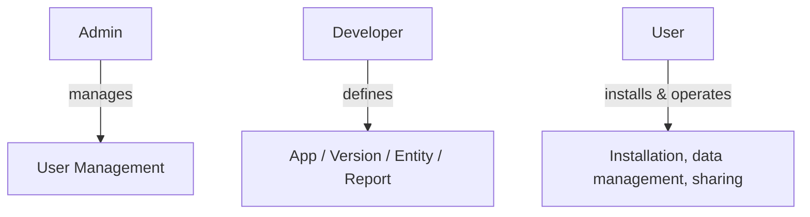
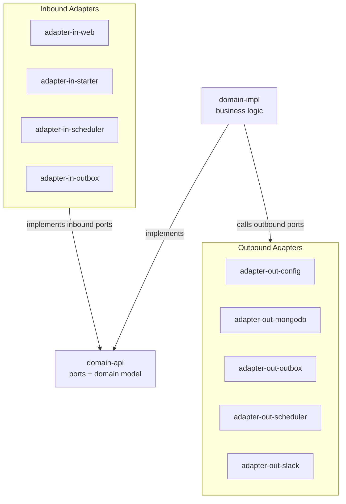
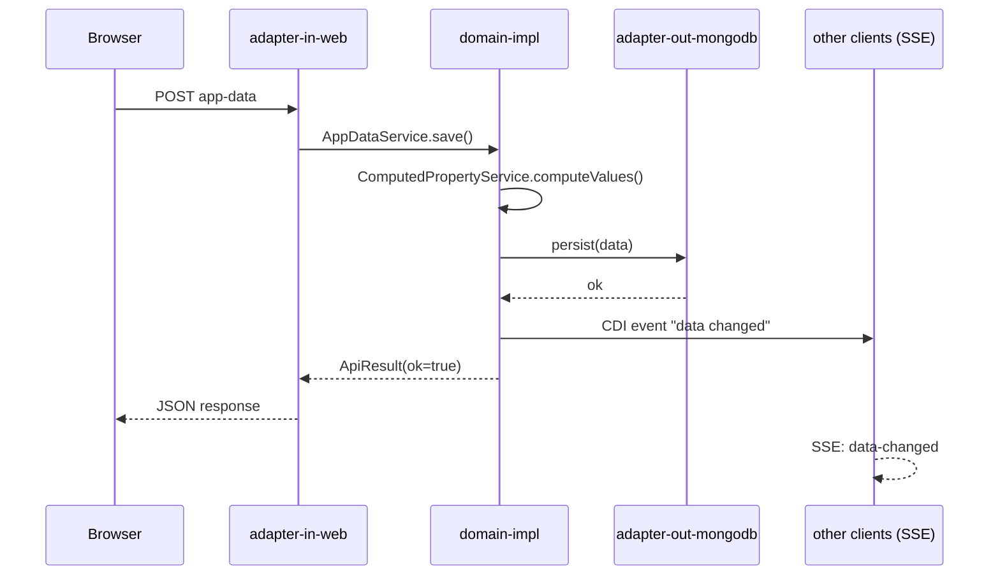
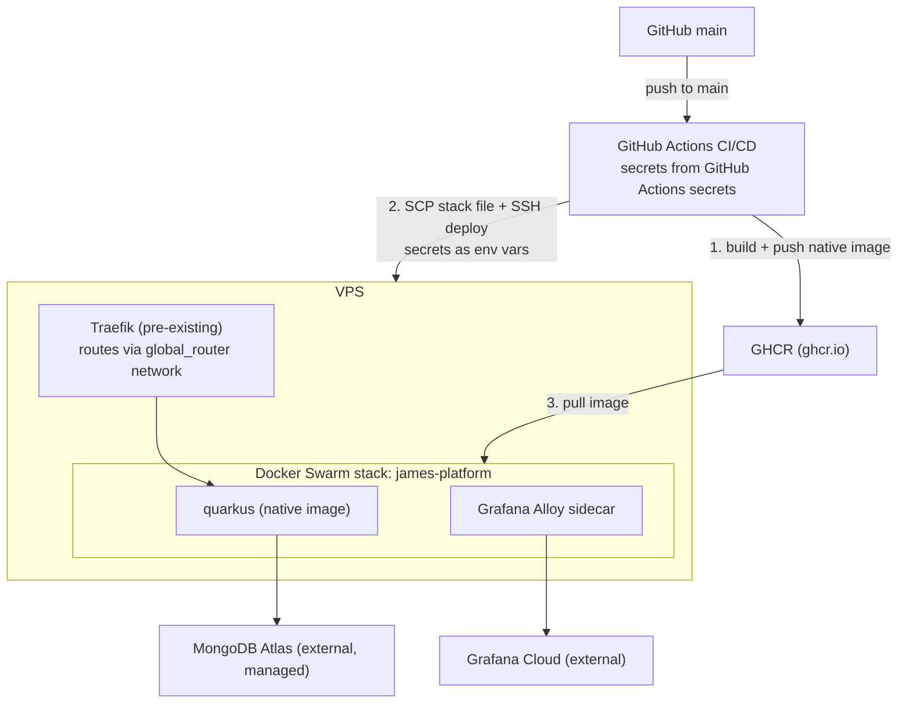

# james-platform

# Introduction and Goals

## Requirements Overview

James Platform is a personal Low Code system for building and running data-centric apps without writing boilerplate infrastructure code.

### Roles

| Role       | Description                                                                                         |
|------------|-----------------------------------------------------------------------------------------------------|
| Admin      | Platform administrator. Manages users. Cannot be a User or Developer at the same time.             |
| Developer  | Creates and maintains Apps. Defines entities, properties, and reports.                              |
| User       | Installs and uses App Versions. Enters, edits, deletes, and views data through the generic UI.     |
| Monitoring | Access to the Tools menu (health, config, logs, metrics, MongoDB viewer). Can be combined with other roles. |
| Data Import | Grants access to the per-app Data Import (ETL) feature. Assignable only by an Admin; typically combined with the User role. |

### User Management

- Self-registration is not supported; only an Admin can register new accounts.
- An Admin can: register users, delete accounts, block/unblock accounts, reset passwords.
- Every account has a unique username, a bcrypt password hash, and one or more roles.

### Apps and Versions

- A Developer creates an **App** and publishes it as a series of **Versions**.
- Each Version carries a **semver** number derived automatically from entity changes:
  - *Breaking change* (removed/renamed entity or property, changed immutable ID, changed unit family or storage granularity on a `long`/`Double` property) → mandatory **Major** release.
  - *Non-breaking change* → Developer chooses between **Feature** or **Bugfix** release.
  - The version number is never entered manually.
- A released Version records a release date and release notes.
- A Developer can attach an optional **migration script** (Kotlin, same JSR-223 sandbox as Computed Properties) to an Entity, transforming existing `AppData` when an
  installation upgrades past that Version. A migration that provably brings all existing data into a valid state (checked via a dry-run at publish time) can neutralize
  what would otherwise be a breaking change, avoiding a mandatory Major bump. Migrations run synchronously as part of the upgrade (auto-upgrade for non-breaking
  Versions, or explicit User-triggered upgrade for breaking ones) — see ADR [0018](../adr/0018-app-version-migration-execution-trigger.md).

### Entities and Properties

- A Version defines **Entities** and **Reports**.
- An Entity has:
  - A name unique within the App.
  - A globally unique internal ID (immutable).
  - An ordered list of **Properties**.
  - An optional **display text template** – a string that interpolates property values (e.g. `{firstName} {lastName}`) into a human-readable label shown for each object in list views and `ref` pickers, instead of a raw ID.
- A Property has:
  - A name unique within the Entity (mutable).
  - An ID unique within the Entity (immutable).
  - A data type and associated constraints.
  - An optional static **default** value, and/or a **smart default** (see below).
  - For `long`/`Double` properties: an optional **unit** (see [Property Units](#property-units)).
  - Optional **value proposals** – a Developer-configured list of suggested values offered to the User as autocomplete options in the create/edit form.
  - For `object` properties: a nested list of Properties, which may themselves be `object` properties (arbitrary nesting depth).
  - For `List` properties: an item type (any type except `List`) and, optionally, item-level constraints.
- **Computed properties** – a Developer may define derived properties by providing a Kotlin script that computes the value based on the entity's other properties. Computed properties may depend on each other; the definition order determines the evaluation sequence. Scripts run backend-side via the JSR-223 Kotlin scripting engine, each on its own virtual thread with a configurable timeout (`app.script.timeout-ms`, default 500ms); a timed-out or failing script yields `null` for that property without failing the surrounding request. There is no deeper sandboxing (no memory/IO isolation) beyond the timeout — see ADR [0008](../adr/0008-computed-property-script-execution.md).
- **Smart defaults** – like a static default, but computed by a Kotlin script (same execution model, engine, and timeout as computed properties) when the create form is opened, seeded with any static defaults already set on the entity. Unlike computed properties, a smart default is only a starting value — the User may freely overwrite it before saving, and it is not re-evaluated afterwards.

### Supported Data Types

| Type       | Description                                                                                           |
|------------|-------------------------------------------------------------------------------------------------------|
| `long`     | 64-bit integer                                                                                        |
| `Double`   | 64-bit floating-point                                                                                 |
| `boolean`  | True/false                                                                                            |
| `String`   | Text                                                                                                  |
| `date`     | Calendar date                                                                                         |
| `time`     | Time of day                                                                                           |
| `datetime` | Combined date and time                                                                                |
| `ref`      | Reference to an object of the same or another Entity within the same App Version                      |
| `List`     | Ordered list of any type except `List`                                                                |
| `object`   | Inline nested object with its own property list (analogous to an anonymous Entity without a global ID) |

Cyclic reference graphs via `ref` are detected and rejected at schema-definition time.

> There used to be a standalone `duration` type, storing its textual input verbatim (e.g. `"1d 2h 30m 15s"`).
> It was replaced by `long` + `PropertyUnit(family = TIME)` and removed entirely, including a one-time
> migration of existing data (see ADR [0017](../adr/0017-duration-migration-and-removal.md)).

### Property Units

A `long`/`Double` property may carry a **`PropertyUnit`**, letting a Developer attach a unit family to a
numeric field and a User enter values as unit-suffixed text (e.g. `15km 400m`) instead of a bare number.

- A `PropertyUnit` has a **`family`** (`TIME` or `DISTANCE`), a **`storageGranularity`**, and a
  **`defaultGranularity`** — both granularities are one of `TimeGranularity` (`MILLISECONDS`, `SECONDS`,
  `MINUTES`, `HOURS`, `DAYS`) or `DistanceGranularity` (`MILLIMETERS`, `CENTIMETERS`, `METERS`,
  `KILOMETERS`), matching the unit's `family`.
- Values are always stored numerically in `storageGranularity` — `UnitFormat` parses a User's textual
  input (e.g. `"15km 400m"` → `15400` at `storageGranularity = METERS`) at write time (see ADR
  [0016](../adr/0016-property-units-storage-granularity.md)). For a `long` property, the converted value
  must be an integer (a fractional result is rejected).
- `storageGranularity` is fixed at field creation and immutable afterward — there is no migration
  mechanism for existing data, so changing it requires recreating the field (a breaking change, see ADR
  [0016](../adr/0016-property-units-storage-granularity.md)). `defaultGranularity` — only the granularity
  pre-selected in the create/edit form — may change freely at any time.

### Constraints

| Constraint   | Applies to    | Description                                                     |
|--------------|---------------|-----------------------------------------------------------------|
| `NOT NULL`   | all types     | Value must be present                                           |
| `UNIQUE KEY` | all types     | All values across all objects of this Entity must be distinct (not applicable to `List`/`object`) |

Additional per-type constraints are supported: `min`/`max`/`step` for `long` and `Double`; `min`/`max` length and a regex `pattern` for `String`; `min`/`max` for `date`, `time`, and `datetime`; `min`/`max` size for `List`. `List` items may carry their own item-level constraints (all of the above except `UNIQUE KEY`).

### Generic User Interface

- **List view** – shows all objects of an Entity; supports deletion, sorting by any column, and user-defined sort parameters. A Developer may configure default sort parameters; the User may override them at runtime.
- **Create / Edit form** – generated automatically from the Entity definition. Three create modes are supported: single-object creation, **Focus** mode (carries values from the previous object forward as defaults for the next one), and **Snapshot** mode (captures the current form state as a reusable template that can be replaced or deleted).

### Data Sharing

A User can invite another User to share the data of an installed App Version.
The shared installation is treated as a separate installation. Supported sharing modes:

| Mode                | Description                                                                          |
|---------------------|--------------------------------------------------------------------------------------|
| Full sharing        | All participants can read, write, and delete all objects.                            |
| Read-all / Edit-own | All participants can see all objects; each can only modify their own.                |

### Reports

**Status: domain model only (`Report`, `Page` in `domain-api`) — no web adapter, endpoint, or UI exists yet.** The rest of this subsection describes the intended design, not current behavior:

- A Report belongs to one App and has a unique name within that App.
- A Report contains at least one **Page**; each Page provides HTML markup and JavaScript logic.
- A Report may declare which entities to load and may define per-Entity filter expressions.
- A set of built-in helper functions (charts, aggregation, date handling, …) is available to every Report; this code is maintained as part of the platform and is not user-supplied.
- A Report may only access data from its own App installation (sandbox boundary).
- The platform must prevent Developers from embedding malicious code in Reports (concept to be finalised — see the sandboxing trade-off already accepted for computed properties in ADR [0008](../adr/0008-computed-property-script-execution.md), which Reports will likely need to revisit given Reports execute in the browser, not backend-side).

### Developer Test Data

A Developer can create a **test installation** of any Version of an App they own — an `InstalledApp` flagged as test-only, excluded from normal User-facing listings,
sharing, and Report data sources. Within a test installation a Developer can:

- Generate constraint-aware test data automatically per Entity (type- and constraint-driven, unit-aware, `ref`-aware with topological generation of referenced objects,
  reproducible via a seed); large generation runs are routed through the outbox (ADR [0019](../adr/0019-persistent-outbox-for-long-running-domain-operations.md)) so
  they don't block the request.
- Hand-craft data via the same generic create/edit UI Users have, reachable from the Developer's App view.

Testing Reports against a test installation is deferred until Report execution/sandboxing is finalized.

### Aggregations

A Developer can declare an **`AggregationDefinition`** on an `EntityDefinition` — a precomputed rollup over that Entity's data, analogous in spirit to a Computed
Property but declarative rather than scripted (see ADR [0020](../adr/0020-aggregation-definitions.md)):

- A **function** (`SUM`, `COUNT`, `AVG`, `MIN`, `MAX`) applied to a numeric `sourceProperty` (`COUNT` accepts any type).
- An optional **`refPath`** (a single-hop `ref` property) groups the aggregation's values per instance of the referenced Entity instead of producing one value across all
  instances, e.g. total kilometers per running shoe via a `Lauf.laufschuhId` reference.
- An optional **`timeBucket`** (`TAG`/`WOCHE`/`MONAT`/`JAHR`) buckets values by day/week/month/year, derived from an optional `timeProperty` (a `date`/`datetime`
  property) or, if unset, the object's `createdAt`.
- An optional **`groupBy`** groups values by another top-level property of the same Entity.

Values are stored as precomputed read-model documents (reusing the storage convention from ADR [0013](../adr/0013-precomputed-read-models-per-ui-page.md)), each carrying
a `status` (`UP_TO_DATE`/`STALE`). Single-object writes update affected aggregations inline via a statically derived dependency index; bulk recomputation (e.g. on
`AppVersion` publish) runs through the outbox (ADR [0019](../adr/0019-persistent-outbox-for-long-running-domain-operations.md)). Aggregation values are shown directly
on the app installation page. Transitive (multi-hop) `ref` chains and true percentiles are deliberately out of scope for the first iteration.

### Data Import (ETL)

A User with the `DATA_IMPORT` role (assignable only by an Admin) can import external JSON data into an installed App as new data objects of a chosen Entity. The concept is split into three independent entities:

- An **`ImportConnection`** (MongoDB collection `import_connection`) holds a name, a source URL, and an optional Bearer token. It is created, tested, and deleted independently of any import, and stays available for reuse until the User deletes it manually. The Bearer token is stored encrypted, never in plain text; "testing" a connection performs a real fetch against its URL/token without persisting anything.
- An **`ImportDefinition`** (MongoDB collection `import_definition`) references an `ImportConnection` and holds everything that configures how the connection's source is turned into target Entity records: the URL postfix, the target Entity, the selected data path, the filter rules, and the Mapping (see ADR [0021](../adr/0021-import-definition-job-split.md)). Like a connection, a definition is independent of any single fetch and survives an accepted job.
- An **`ImportJob`** (MongoDB collection `import_job`) references an `ImportDefinition` and runs through a guided fetch → detect → map → dry-run → accept flow. Unlike a definition, a job only holds the data snapshot fetched at one point in time (raw payload, detected data paths, detected/filtered schema, status) and is cleaned up automatically once it has been inactive for too long.

The flow:

- **Fetch** – the User picks an existing `ImportConnection` and a target Entity, which creates a fresh `ImportDefinition`; the server fetches the connection's URL server-side (using its stored, decrypted Bearer token, if any) and stores the raw response on the `ImportJob`. Because the URL and token are User-supplied at connection creation time, the fetch is hardened against SSRF (scheme allow-list, blocked address ranges, no redirects, size cap) – see ADR [0010](../adr/0010-import-fetch-ssrf-protection.md). The response must be a JSON object; oversized responses are rejected.
- **Data-path detection** – the payload is scanned for every JSON path pointing to a non-empty array of objects (a candidate "data path", e.g. `results.items`). If exactly one candidate is found it is selected automatically; otherwise the User picks one manually. The selected path is stored on the `ImportDefinition`.
- **Schema detection** – for the objects at the selected data path, the platform infers a per-field schema (type, mandatory-ness, numeric range, string length, date/datetime detection) used to validate the mapping. This schema stays visible to the User throughout the Quelle, Filter and Mapping steps via a shared schema panel (opened from an offcanvas side panel), so field names and types remain a reference at hand without switching tabs.
- **Mapping** – the User maps each source field to a property of the definition's fixed target Entity, optionally applying a lossless type conversion (e.g. string-to-long) or a static fallback value. A target property with a `PropertyUnit` (see [Property Units](#property-units)) additionally requires an **import granularity**: the `Granularity` (of the unit's `family`) the source data is expressed in, e.g. source values in kilometers mapped onto a field with `storageGranularity = METERS`. The raw value is converted from the import granularity to `storageGranularity` using each granularity's fixed conversion ratio, generalized to any unit family (see ADR [0016](../adr/0016-property-units-storage-granularity.md)). REF properties may instead be resolved via a `find`-only reference lookup against existing data of the referenced Entity – there is deliberately no `findOrCreate` equivalent, so a lookup never creates a referenced object as a side effect (see ADR [0011](../adr/0011-import-single-mapping-scope.md)). A definition holds a single Mapping. The mapping becomes valid once mandatory-field coverage, type compatibility, constraint pre-checks, and (for unit properties) the import granularity being set all pass; pattern/regex constraints are deferred to the dry run.
- **Dry run** – builds every target object from the source data without persisting anything, surfacing per-object validation issues (including pattern constraints and reference-existence checks). Reachable as soon as a Mapping is saved, even if it still has blocking validation issues, so those issues can be debugged against the actual source records instead of only the abstract per-field checks shown on the Mapping step.
- **Accept** – re-runs the dry run, persists every valid object as data of the target Entity, discards invalid ones, and deletes the `ImportJob` (including the raw payload) regardless of how many objects were saved or discarded. The referenced `ImportConnection` and `ImportDefinition` are left untouched and stay available for future jobs. Unlike the dry run, Accept still requires a fully valid Mapping (see ADR [0011](../adr/0011-import-single-mapping-scope.md)).
- **Cleanup** – a daily cronjob deletes import jobs older than a configurable retention period, including any left in an incomplete state (see [Configuration](#configuration)). `ImportConnection`s and `ImportDefinition`s are never deleted automatically.
- **Scheduled runs** – an `ImportDefinition` with a fully configured data path and Mapping may additionally carry a cron `schedule`. A poller (`ImportDefinitionScheduleJob`, running every minute) evaluates each scheduled definition's cron expression against its `lastRunAt` and, once due, runs an unattended fetch → accept using the definition's stored data path/filter/mapping unchanged - no interactive steps, no manual dry-run accept. To avoid silently importing data that no longer matches the configured Mapping, a scheduled run compares the freshly detected schema against the definition's `lastKnownSchema` baseline (the schema of the last run that was allowed to proceed) and aborts without accepting on any deviation. `lastRunAt` is updated after every scheduled run, successful or not, so the poller never re-triggers the same due definition twice.
- **Scheduled run notifications** – a definition with `notifyOnSlack` set sends a best-effort Slack summary (via the existing `NotificationPort`/`SlackNotificationAdapter`, see [Configuration](#configuration)) after every scheduled run: `ImportScheduleService` reports a run that failed before a job could even be queued (including an explicit warning on schema deviation, so a human can review the definition's filter/mapping), while `ImportService.handle` reports the eventual saved/discarded object count once the asynchronous accept (see ADR [0019](../adr/0019-persistent-outbox-for-long-running-domain-operations.md)) completes for a system-triggered job.
- **Import-Definitionen overview** – a dedicated `/ui/user/imports/definitions` page (linked from the Import job list, analogous to the Connections page) lists every `ImportDefinition` with its source, target App/Entity, current schedule, next computed run, and last run. "Jetzt ausführen" re-runs an already-configured definition unattended (`ImportPort.triggerDefinitionRun`, same fetch → accept pipeline and schema-drift guard as a scheduled run, recorded with `ImportTrigger.USER`), a schedule modal sets/clears the cron expression and `notifyOnSlack` in one save, and a definition can be deleted (its still-unaccepted `ImportJob`s, if any, are left in place, same as deleting an `ImportConnection` does not cascade). The next-run column is purely informational, computed on the fly from the stored cron expression (`CronSchedule.nextFireTime`, exposed via `ImportPort.nextScheduledRunAt`) - `ImportDefinition` itself stores no `nextRunAt`.

## Quality Goals

| Priority | Quality Goal     | Motivation                                                                                    |
|----------|------------------|-----------------------------------------------------------------------------------------------|
| 1        | Correctness      | Entity schema constraints and cyclic-reference detection must be enforced without exception.  |
| 2        | Security         | Role-based access control, cookie security, and Report sandboxing protect user data.          |
| 3        | Developer UX     | App and schema creation must feel lightweight; no boilerplate for common CRUD patterns.       |
| 4        | Reliability      | Long-running domain operations (import, deletion, migration) are routed through a persistent outbox for at-least-once execution; external notifications remain best-effort. |
| 5        | Maintainability  | Hexagonal architecture and clear module boundaries keep the codebase understandable.          |

# Architecture Constraints

| Constraint                          | Rationale                                                                                                 |
|-------------------------------------|-----------------------------------------------------------------------------------------------------------|
| Single developer / hobby project    | Low operational overhead is paramount; no team conventions, no enterprise tooling.                       |
| No self-registration                | The platform is invite-only; all accounts are created by an Admin.                                       |
| No separate frontend deployment     | Qute SSR keeps the stack simple; no npm/Node.js build step.                                              |
| VPS + Docker Swarm deployment       | The platform runs on an existing personal VPS; no Kubernetes or cloud-managed container orchestration.   |
| MongoDB Atlas as data store         | Flexible document model suits dynamic entity schemas; cloud-managed removes operational burden.           |
| Reports must be sandboxed           | Developers must not be able to inject code that accesses data outside their own App installation.         |
| Version numbers are never manual    | Semver is derived automatically from schema changes to guarantee semantic accuracy.                      |
| No cyclic entity references         | Cycle detection is enforced at schema-definition time to prevent infinite loops during data traversal.    |

# Context and Scope

## Business Context

James Platform is a personal Low Code system. Its primary purpose is to let a single Developer define data models (Entities) and user-facing views (Reports), then let Users install and operate those App Versions to manage their own data – all without writing infrastructure code.


```mermaid
graph TD
    Admin["Admin"] -->|manages| UserMgmt["User Management"]
    Developer["Developer"] -->|defines| AppDef["App / Version / Entity / Report"]
    User["User"] -->|installs & operates| AppOps["Installation, data management, sharing"]
```

**External actors:**

| Actor     | Interaction                                                              |
|-----------|--------------------------------------------------------------------------|
| Admin     | Registers, blocks, resets passwords for, and deletes user accounts       |
| Developer | Creates Apps, Versions, Entities (with properties), and Reports          |
| User      | Installs App Versions, manages objects via generic UI, shares data        |

## Technical Context

| Component          | Technology                     | Notes                                                         |
|--------------------|--------------------------------|---------------------------------------------------------------|
| Backend            | Quarkus (Kotlin, JVM / native) | Hexagonal architecture; all business logic in `domain-impl`   |
| Templating         | Qute (Quarkus SSR)             | Server-side rendering; no separate frontend project           |
| Database           | MongoDB Atlas                  | Document model for dynamic entity schemas                     |
| Authentication     | Cookie-based (AES session)     | Bcrypt password hashing; role-enforced via `QuarkusIdentity`  |
| Reverse proxy      | Traefik                        | TLS termination, HTTPS, on existing VPS                       |
| CI/CD              | GitHub Actions                 | Build, test, native Docker image, deploy to Docker Swarm      |

# Solution Strategy

| Goal              | Design decision                                                                                                    |
|-------------------|--------------------------------------------------------------------------------------------------------------------|
| Correctness       | Constraint validation and cyclic-reference detection in the domain layer; enforced before any persistence write.   |
| Security          | Role-based access via `QuarkusSecurityIdentity`; `HttpOnly` AES session cookie; computed-property scripts run with a timeout guard only, no deeper sandbox (Report sandboxing still a concept, see [Reports](#reports)). |
| Developer UX      | Generic CRUD UI generated from Entity metadata; semver auto-derived; no boilerplate for common patterns.           |
| Reliability       | External operations (notifications, …) are delivered on a best-effort basis; long-running domain operations (import, deletion, migration) use a persistent outbox for at-least-once execution, see [ADR-0019](../adr/0019-persistent-outbox-for-long-running-domain-operations.md). |
| Maintainability   | Hexagonal architecture with strict module-dependency rules; zero infrastructure in `domain-api` / `domain-impl`.   |
| Flexible schemas  | MongoDB document model maps naturally to dynamic Entity/Property definitions.                                      |
| Simple deployment | Quarkus native Docker image + Docker Swarm on existing VPS; MongoDB Atlas as managed database.                     |

# Building Block View

## Whitebox Overall System

The system follows a hexagonal (ports & adapters) architecture, see ADR
[0002](../adr/0002-backend-hexagonal-architecture.md). `domain-api` and `domain-impl` contain
all business logic and are free of infrastructure dependencies; every inbound and outbound
integration lives in its own `adapter-*` module and depends inward on `domain-api` only. A
per-module dependency graph is generated on every build via the `dev.iurysouza.modulegraph`
Gradle plugin into `build/reports/modulegraph/modules.md` — regenerate it for the precise,
always-current picture; the diagram below is a simplified, hand-maintained overview of the
dependency direction only.


```mermaid
flowchart TB
    subgraph Inbound["Inbound Adapters"]
        AIW["adapter-in-web"]
        AIS["adapter-in-starter"]
        AISC["adapter-in-scheduler"]
        AIO["adapter-in-outbox"]
    end

    DA["domain-api<br/>ports + domain model"]
    DI["domain-impl<br/>business logic"]

    subgraph Outbound["Outbound Adapters"]
        AOC["adapter-out-config"]
        AOM["adapter-out-mongodb"]
        AOO["adapter-out-outbox"]
        AOS["adapter-out-scheduler"]
        AOSL["adapter-out-slack"]
    end

    Inbound -->|implements inbound ports| DA
    DI -->|implements| DA
    DI -->|calls outbound ports| Outbound
```

`application-quarkus` wires all of the above together (CDI, configuration, tests).

### Module Overview

Base package: `de.chrgroth.james.platform`

| Module                | Direction  | Responsibility                                                                        |
|-----------------------|------------|---------------------------------------------------------------------------------------|
| `domain-api`          | –          | Ports (interfaces) and domain model only – zero infrastructure                        |
| `domain-impl`         | –          | Business logic implementing the inbound port interfaces                               |
| `adapter-in-web`      | inbound    | HTTP endpoints, Qute SSR templates, SSE adapters, cookie auth mechanism               |
| `adapter-in-starter`  | inbound    | One-time startup beans (starters) for data migrations and one-time bugfixes           |
| `adapter-in-scheduler` | inbound   | Wired with the Quarkus scheduler extension; runs the `@Scheduled` import job cleanup cronjob |
| `adapter-in-outbox`   | inbound    | `ApplicationOutboxDispatcher` implementation; dispatches claimed outbox tasks into domain inbound ports |
| `adapter-out-config`  | outbound   | Reads Quarkus/MicroProfile config and environment variables for health/config display |
| `adapter-out-mongodb` | outbound   | MongoDB persistence: user repository, MongoDB viewer, stats adapter                  |
| `adapter-out-outbox`  | outbound   | Wraps the `de.chrgroth.quarkus.outbox` library's client; enqueues and queries outbox tasks |
| `adapter-out-scheduler` | outbound | Reads Quarkus scheduler metadata for health/cronjob display                          |
| `adapter-out-slack`   | outbound   | Slack notification adapter                                                            |
| `application-quarkus` | –          | Wiring only: CDI, configuration, integration tests                                   |

Note: a `core` module also exists in the repository (`Errors.kt`, `Utils.kt`, pre-dating the
current hexagonal structure) but is **not** included in `settings.gradle.kts` and is not part
of the build — dead weight left over from an earlier project iteration, not a real module.

Note: `ImportFetchAdapter`, which performs the outbound HTTP fetch for the Data Import (ETL)
feature (see ADR [0010](../adr/0010-import-fetch-ssrf-protection.md)), is packaged inside the
inbound `adapter-in-web` module rather than a dedicated outbound adapter module — there is no
`adapter-out-http`-style module to host it in. This is the one exception to the otherwise
strict inbound/outbound module split described above; see [Technical Debts](#technical-debts).

### External Dependencies

Three of Chris's own projects, all hosted as GitHub Packages (Maven repositories declared in
`settings.gradle.kts`, resolved with a `GHCR_PAT`/`GITHUB_ACTOR` credential):

- [christiangroth/quarkus-one-time-starters](https://github.com/christiangroth/quarkus-one-time-starters) — runtime dependency, three artifacts:
  - `domain-api` – contracts: `Starter`, `StarterSkipPredicate`, `StarterCompletionFlag`
  - `domain-impl` – execution orchestration and startup observer
  - `adapter-out-persistence-mongodb` – MongoDB persistence for starter execution state
- [christiangroth/quarkus-outbox](https://github.com/christiangroth/quarkus-outbox) — runtime dependency, reintroduced by [ADR-0019](../adr/0019-persistent-outbox-for-long-running-domain-operations.md)
  scoped to a single, un-throttled "domain" partition (an earlier, multi-partition, rate-limit-aware version
  of this same library was removed entirely in [#215](https://github.com/christiangroth/james-platform/pull/215)).
  Five artifacts:
  - `domain-api` – outbox contracts: `ApplicationOutboxPartition`, `ApplicationOutboxEvent`,
    `ApplicationOutboxDispatcher`, `ApplicationOutboxClient`, `DispatchResult`, and associated types
  - `domain-impl` – CDI-managed orchestration: enqueue/dispatch control, retry policy, archiving, startup
    recovery of stale tasks
  - `adapter-out-executor` – coroutine-based per-partition dispatch workers
  - `adapter-out-persistence-mongodb` – MongoDB persistence: at-least-once delivery, atomic claim, task
    deduplication, priority ordering
  - `adapter-in-scheduler` – scheduled daily archive-retention cleanup and event-type-count reconciliation
- [christiangroth/gradle-release-notes-plugin](https://github.com/christiangroth/gradle-release-notes-plugin) — build-time Gradle plugin (`de.chrgroth.gradle.release-notes`) that
  compiles `docs/releasenotes/snippets/*.md` into `docs/releasenotes/RELEASENOTES.md` on
  release; not a runtime dependency of the application itself. See [Release
  Process](#release-process).

# Runtime View

Example: a User saves an object through the generic data-entry form, triggering computed
properties and a live update to any other connected client of the same installation.


```mermaid
sequenceDiagram
    participant B as Browser
    participant W as adapter-in-web
    participant D as domain-impl
    participant M as adapter-out-mongodb
    participant O as other clients (SSE)

    B->>W: POST app-data
    W->>D: AppDataService.save()
    D->>D: ComputedPropertyService.computeValues()
    D->>M: persist(data)
    M-->>D: ok
    D->>O: CDI event "data changed"
    D-->>W: ApiResult(ok=true)
    W-->>B: JSON response
    O-->>O: SSE: data-changed
```

Other notable flows:

- **Login:** `POST /login` → `LoginServicePort` verifies the bcrypt hash → on success, an
  AES-encrypted session cookie is issued and the user is redirected by role to
  `/ui/{user|developer|admin}/dashboard` (`303`, not `307`, to avoid re-submitting the login
  form on redirect).
- **Computed property evaluation:** on every data read/write through `AppDataService`,
  `ComputedPropertyService` evaluates each entity's computed properties in definition order on
  a virtual thread with a timeout (default 500ms); a timeout or script error yields `null` for
  that property without failing the request (see [Computed properties](#entities-and-properties)
  and ADR [0008](../adr/0008-computed-property-script-execution.md)).
- **Live updates:** browser clients open a per-user SSE connection; domain services fire CDI
  events on state changes, which `DashboardSseAdapter`/`HealthSseAdapter` (in `adapter-in-web`)
  translate into named SSE events pushed to connected clients (see [Server-Sent Events (SSE)
  and Live Updates](#server-sent-events-sse-and-live-updates)).
- **Outbox dispatch** (see ADR [0019](../adr/0019-persistent-outbox-for-long-running-domain-operations.md)):
  a domain service calls `OutboxPort.enqueue()` with a `DomainOutboxEvent`; `adapter-out-outbox` persists it
  via the `de.chrgroth.quarkus.outbox` library's MongoDB adapter and returns immediately. A library-managed
  worker later claims the task and calls `DomainOutboxTaskDispatcher.dispatch()` in `adapter-in-outbox`
  to actually execute the operation, by calling into domain inbound ports – the dispatcher drives the domain,
  so it is an inbound, not outbound, adapter, mirroring the split already used in the sister project
  [spotify-control](https://github.com/christiangroth/spotify-control). Failures are retried with backoff.
  Archiving (`outbox.archive.enabled`) is switched off in this project – completed and permanently failed
  tasks are deleted from the `outbox` collection outright instead of being copied into `outbox_archive` first,
  so no historical record of dispatched or failed tasks is kept. Import accept (`ImportService.acceptDryRun`,
  `DomainOutboxEvent.AcceptDryRun`), app uninstall (`UserAppStoreService.uninstallApp`,
  `DomainOutboxEvent.UninstallApp`), app deletion (`AppManagementService.deleteApp`,
  `DomainOutboxEvent.DeleteApp`), user deletion including its cascading installed-app/AppData cleanup
  (`AdminUserManagementService.deleteUser`, `DomainOutboxEvent.DeleteUser`), and bulk App Version auto-upgrade on
  publish, one event per installation (`AppVersionManagementService.autoUpgradeInstallations`,
  `DomainOutboxEvent.AutoUpgradeInstallation`) are routed through this flow, completing series
  [#543](https://github.com/christiangroth/james-platform/issues/543); the single-installation, User-triggered
  `UserAppStorePort.upgradeApp()` stays synchronous in-request, see ADR [0018](../adr/0018-app-version-migration-execution-trigger.md).

# Deployment View

## Infrastructure Level 1

The application is deployed on an existing VPS running Docker Swarm. Traefik handles routing, TLS termination, and HTTPS. MongoDB is hosted externally on MongoDB Atlas.

| Component     | Technology              | Notes                                      |
|---------------|-------------------------|--------------------------------------------|
| Application   | Quarkus (native Docker) | Deployed as a Docker Swarm service         |
| Reverse Proxy | Traefik                 | TLS via Let's Encrypt, already provisioned |
| Database      | MongoDB Atlas           | Two projects: prod + dev                   |


```mermaid
flowchart TB
    GH["GitHub main"] -->|push to main| CI["GitHub Actions CI/CD<br/>secrets from GitHub Actions secrets"]
    CI -->|1. build + push native image| GHCR["GHCR (ghcr.io)"]
    CI -->|2. SCP stack file + SSH deploy<br/>secrets as env vars| VPS
    GHCR -->|3. pull image| Swarm

    subgraph VPS["VPS"]
        Traefik["Traefik (pre-existing)<br/>routes via global_router network"]
        subgraph Swarm["Docker Swarm stack: james-platform"]
            Quarkus["quarkus (native image)"]
            Alloy["Grafana Alloy sidecar"]
        end
        Traefik --> Quarkus
    end

    Quarkus --> Mongo["MongoDB Atlas (external, managed)"]
    Alloy --> Grafana["Grafana Cloud (external)"]
```

## Infrastructure Level 2

Secrets are never committed to Git or hardcoded. Locally, they come from a git-ignored `.env`
file (`dev.sh`/`prod.sh`). For CI/CD and production, they are configured as **GitHub Actions
repository secrets** and flow into the deployment as follows: the `gradle.yml` release job
reads them via `${{ secrets.* }}`, passes them as environment variables into the
`appleboy/ssh-action` SSH step, and the deploy script on the VPS forwards them into
`docker stack deploy`'s environment so the running containers pick them up — the deploying
GitHub Actions runner never writes them to a file on the VPS.

### Environments

|                 | Local                     | Production         |
|-----------------|---------------------------|--------------------|
| MongoDB         | Atlas Dev Cluster         | Atlas Prod Cluster |
| Quarkus Profile | `dev`                     | `prod`             |
| Container       | no (direct Quarkus start) | Docker Swarm       |

Quarkus profile is controlled via environment variable:

```bash
QUARKUS_PROFILE=prod
```

### Deployment Workflow

Build the application as a Quarkus native Docker image, push to the GitHub Container Registry, copy the Docker stack file to the VPS via SCP, and deploy via Docker Swarm stack.

### Release Process

- **Release plugin** – `net.researchgate.release` manages version bumping and Git tagging
- **Release-Notes plugin** – custom Gradle plugin (`de.chrgroth.gradle.plugins.release-notes`) maintained in https://github.com/christiangroth/gradle-release-notes-plugin
- **CI/CD** – the GitHub Actions workflow (`gradle.yml`) runs `./gradlew build` on every push; runs `./gradlew release` only on pushes to `main`; after release, the Docker stack
  file is copied to the VPS via SCP and the stack is deployed via SSH. All secrets (including `SLACK_WEBHOOK_URL`) must be configured as GitHub Actions repository secrets.
- **Snippet requirement** – every branch that is not `main` or `dependabot/*` **must** contain at least one release note snippet in `docs/releasenotes/snippets/`; the build fails
  without it. Create snippets with the corresponding Gradle tasks (`releasenotesCreateFeature`, `releasenotesCreateBugfix`, …); filenames follow the pattern
  `{branch-last-segment}-{type}.md`

# Cross-cutting Concepts

## Testing Strategy

Tests follow the *Test Your Boundaries* principle mapped to the hexagonal architecture:

| Layer                   | Entry point                            | Test doubles                                            | Module                    | Framework                     |
|-------------------------|----------------------------------------|---------------------------------------------------------|---------------------------|-------------------------------|
| 1 – Domain logic        | Inbound port (`*Port` in `domain-api`) | MockK mocks for all outbound ports                      | `domain-impl`             | JUnit 5 + MockK               |
| 2 – Outbound adapters   | Outbound port interface                | None – real infra (MongoDB dev-service, external mocks) | `application-quarkus`     | `@QuarkusTest`                |
| 3 – Inbound adapters    | HTTP endpoint / scheduler `run()`      | CDI mocks via `@InjectMock`                             | `application-quarkus`     | `@QuarkusTest` + REST Assured |
| 4 – App wiring          | Health/metrics endpoints               | None                                                    | `application-quarkus`     | `@QuarkusTest`                |
| 5 – Adapter-local logic | Class under test                       | MockK mocks                                             | individual adapter module | JUnit 5 + MockK               |

Layer 5 applies to adapter modules where the logic is pure (e.g. `adapter-in-starter`, `adapter-in-outbox`, `adapter-out-scheduler`, `adapter-out-outbox`).

## Authentication and Access Control

Authentication is cookie-based:

- The user logs in via a username/password form (`POST /login`).
- On success, a `LoginServicePort` validates the credentials; the password hash is verified against the stored bcrypt hash.
- An encrypted session token (AES via `TokenEncryptionPort`) is written into an `HttpOnly` cookie named `james-session`.
- Every subsequent request is authenticated by `CookieAuthMechanism`, which decrypts the cookie, loads the user from `UserRepositoryPort`, and builds a `QuarkusSecurityIdentity` with the user's roles.
- On logout (`GET /logout`), the cookie is invalidated by setting it to an empty value with `maxAge=0`.
- Users have one of four roles (`USER`, `DEVELOPER`, `ADMIN`, `MONITORING`), which control which dashboard is shown after login and which navigation items are visible.

## Error Handling

All domain failures are represented as typed `DomainError` values wrapped in Arrow's `Either<DomainError, T>`.

- Port interfaces return `Either<DomainError, T>` instead of raw domain objects or throwing exceptions.
- Infrastructure adapters (`adapter-out-*`) catch all exceptions at the adapter boundary and convert them to typed `Either.Left<DomainError>` values – no exceptions cross port
  boundaries.
- Domain services compose multiple fallible operations using the Arrow `either { }` DSL with `bind()`.
- Web adapters translate `Either.Left<DomainError>` to HTTP error responses (redirect with `?error=<code>`).
- Error codes follow the convention `<AREA>-<NNN>` (e.g. `LOGIN-001`). Codes are stable once published.

## Server-Sent Events (SSE) and Live Updates

Backend services notify SSE streams via CDI events. The SSE endpoint delivers the initial state on connect, then pushes named update events to connected clients via per-user
reactive streams.

## Starters

One-time startup beans for data migrations, schema changes, and one-time bugfixes. Each starter executes exactly once in `NORMAL` (prod) mode; failed starters are retried on the
next application start. The Quarkus scheduler is blocked until all starters succeed.

## Frontend Approach

No separate frontend project. The UI is rendered server-side using Quarkus Qute templates. Dynamic interactions are handled via vanilla JS with the fetch API. No React, Vue, npm,
Node.js, or build steps are required.

**Technology stack:**

- Templates: Qute (Quarkus SSR)
- CSS: Bootstrap 5 via WebJar
- Interactivity: Vanilla JS (fetch API)
- Icons: Bootstrap Icons via WebJar
- Live Updates: Server-Sent Events via native `EventSource` API
- Markdown rendering: marked via WebJar (docs and release notes pages)
- Diagram rendering: Mermaid via WebJar (Docs page only; GitHub renders the same `​```mermaid` blocks natively)

**Design target:** The primary use case is a smartphone. All pages must work on narrow screens. Tables must be wrapped in `<div class="table-responsive">`.

**Reusable UI components** are defined as CSS classes in `layout.html` and Qute tags in `templates/tags/`. Templates must use these component classes (e.g. `.app-card`,
`.app-table`, `.app-modal-content`, `.app-accordion-item`, `.breadcrumb-link`) instead of inline styles. See `docs/coding-guidelines/role-frontend-developer.md` for the full
class reference.

**Navigation concept:** Each page deeper than the dashboard root uses a breadcrumb trail at the top of the content area. The breadcrumb always starts with a home icon
(`{#breadcrumb-home ...}` tag) pointing to the role-specific dashboard, followed by intermediate items as `<a class="breadcrumb-link">` links, and ends with the current
page as a non-clickable `<li class="breadcrumb-item active">` item.

## Documentation and Release Notes Serving

Architecture documentation (`docs/arc42`), ADRs (`docs/adr`), and release notes (`docs/releasenotes`) are served to the logged-in user directly from the application. A Gradle copy
task bundles the Markdown files into the `adapter-in-web` classpath at build time. A `DocsResource` endpoint reads and passes the raw Markdown to Qute templates; the `marked`
WebJar renders it in the browser. Diagrams are authored as `​```mermaid` fenced code blocks — rendered natively by GitHub, and rendered in-app by the `mermaid` WebJar, which
post-processes `marked`'s output (see ADR [0009](../adr/0009-diagram-rendering-mermaid.md)).

## Configuration

All secrets are provided via environment variables, never committed to Git or hardcoded —
locally via a git-ignored `.env` file (`dev.sh`/`prod.sh`), in CI/CD via GitHub Actions
repository secrets (`gradle.yml`), and at runtime via the Docker stack's `environment:` block
(`deploy/docker-stack.yml`):

| Variable                          | Purpose                                                          |
|------------------------------------|-------------------------------------------------------------------|
| `MONGODB_CONNECTION_STRING`        | MongoDB Atlas connection string (prod profile)                    |
| `APP_TOKEN_ENCRYPTION_KEY`         | AES key for session-cookie encryption (`TokenEncryptionPort`)     |
| `SLACK_WEBHOOK_URL`                | Slack incoming webhook for system notifications (optional)        |
| `TRAEFIK_HTTP_ROUTERS_JAMESPLATFORM_RULE` | Traefik routing rule for the deployed service                |
| `GHCR_PAT`                         | GitHub Container Registry / Package Registry token (CI + runtime pull) |
| `GRAFANA_CLOUD_{METRICS,LOGS}_{URL,USERNAME,API_KEY}` | Grafana Cloud remote-write/Loki credentials (Alloy sidecar) |
| `CONTABO_SSH_{HOST,USER,PRIVATE_KEY}` | Deployment target SSH access (release workflow)                |
| `CLAUDE_CODE_OAUTH_TOKEN`          | Claude Code GitHub Action authentication                          |

**Secret masking:** the in-app `/config` and `/health` pages render live Quarkus/MicroProfile
config, but redact values for keys listed in `app.health.masked-config-keys` /
`app.health.masked-env-keys` (`adapter-in-web` `application.properties`). Any new
secret-backed config key must be added to this list in the same change that introduces it —
this has been missed historically.

**Other notable non-secret config:** `app.script.timeout-ms` (computed-property/smart-default
script timeout, default 500ms), `app.mongodb.slow-query-threshold-ms` (default 100ms),
`app.imports.cleanup.retention-days` (import job cleanup cronjob, default 14 days),
`app.imports.cleanup.cron` (cleanup cronjob schedule, `adapter-in-scheduler` `application.properties`),
`app.imports.schedule.poll-cron` (how often the `ImportDefinition` schedule poller checks for due definitions,
default every 15 minutes - matching the minimum interval `CronSchedule` enforces on a definition's own schedule,
`adapter-in-scheduler` `application.properties`),
`quarkus.default-locale`/`quarkus.locales` (i18n, `de` + build-generated pseudo-locale `xx`),
`outbox.archive.enabled` (outbox archive collection disabled, `false`), `outbox.archive.retention-days`
(outbox archive cleanup, default 30 days, currently unused while archiving is disabled; see ADR
[0019](../adr/0019-persistent-outbox-for-long-running-domain-operations.md)).

# Architecture Decisions

| ADR                                                         | Title                                              |
|-------------------------------------------------------------|----------------------------------------------------|
| [0001](../adr/0001-using-arc42-as-project-documentation.md) | Using arc42 as Project Documentation               |
| [0002](../adr/0002-backend-hexagonal-architecture.md)       | Backend: Hexagonal Architecture                    |
| [0003](../adr/0003-no-separate-frontend-project.md)         | No Separate Frontend Project                       |
| [0004](../adr/0004-using-ai-coding-agents.md)               | Using AI Coding Agents                             |
| [0005](../adr/0005-markdown-rendering-library.md)           | Markdown Rendering Library: marked                 |
| [0006](../adr/0006-error-handling-concept.md)               | Error Handling: Arrow Either&lt;DomainError, T&gt; |
| [0007](../adr/0007-local-cookie-based-authentication.md)    | Authentication: Local Cookie-Based Sessions         |
| [0008](../adr/0008-computed-property-script-execution.md)   | Computed Property Scripts: Backend Kotlin Scripting with Timeout Guard |
| [0009](../adr/0009-diagram-rendering-mermaid.md)             | Diagram Rendering: Mermaid                          |
| [0010](../adr/0010-import-fetch-ssrf-protection.md)          | Data Import Fetch: SSRF Protection                  |
| [0011](../adr/0011-import-single-mapping-scope.md)           | Data Import Mapping: Single Mapping, Find-Only Reference Lookups |
| [0012](../adr/0012-import-connection-job-split.md)           | Data Import: Separate Reusable Connection from Per-Run Job |
| [0013](../adr/0013-precomputed-read-models-per-ui-page.md)   | Precomputed Read Models per UI Page (Scoped CQRS Exception) |
| [0014](../adr/0014-app-lifecycle.md)                          | App Lifecycle: Non-Blocking Deactivation, Blocking Hard Delete |
| [0015](../adr/0015-import-object-preview-endpoint.md)         | Import Filter Preview: Per-Record Sample Endpoint Reusing FilterEvaluator |
| [0016](../adr/0016-property-units-storage-granularity.md)     | Property Units: Fixed Numeric Storage Granularity, Immutable After Creation |
| [0017](../adr/0017-duration-migration-and-removal.md)         | Duration Type: Migration to Property Units and Removal |
| [0018](../adr/0018-app-version-migration-execution-trigger.md) | App Version Migrations: Synchronous, In-Request Execution on Upgrade |
| [0019](../adr/0019-persistent-outbox-for-long-running-domain-operations.md) | Persistent Outbox for Long-Running Domain Operations |
| [0020](../adr/0020-aggregation-definitions.md)                | Aggregation Definitions: Combining Precomputed Read Models and the Outbox |
| [0021](../adr/0021-import-definition-job-split.md)            | Data Import: Separate Reusable Definition from Per-Run Job |

# Risks and Technical Debts

## Risks

- **Computed-property scripts have no real sandbox** — only a timeout guard (see ADR
  [0008](../adr/0008-computed-property-script-execution.md)). A Developer account is trusted;
  if that trust model ever changes (e.g. multi-tenant, non-trusted Developers), this needs
  revisiting before Reports (which are meant to run Developer-supplied code too) are built.
- **No static analysis tooling.** detekt was removed while fixing an unrelated session-cookie
  bug and never reinstated; regressions in code quality/complexity are currently only caught
  by review, not CI.
- **Single external dependency for auth secrets.** `APP_TOKEN_ENCRYPTION_KEY` must never
  change in production (invalidates all sessions) and has no rotation mechanism.

## Technical Debts

- **Dead `core/` Gradle module** (`core/src/main/kotlin/.../Errors.kt`, `Utils.kt`) is tracked
  in git but not included in `settings.gradle.kts` — leftover from the project's pre-hexagonal
  "SpCtl" history, safe to delete.
- **Stale root-level `docker-stack.yml`** (Postgres-based) is superseded by the actively used
  `deploy/docker-stack.yml` (MongoDB-based) but still sits at the repository root, tracked in
  git — safe to delete.
- **Reports are domain-model-only** (see [Reports](#reports)) — `Report`/`Page` types exist
  but there is no adapter, endpoint, or UI; the corresponding sandboxing story is also still
  unresolved (see Risks above).
- **`ImportFetchAdapter` lives in the inbound `adapter-in-web` module** even though it performs
  an outbound HTTP call (see [Module Overview](#module-overview)) — there is no dedicated
  outbound HTTP adapter module to host it in instead. Not a correctness issue, but breaks the
  otherwise strict inbound/outbound module split.

# Glossary

| Term              | Definition                                                                                                        |
|-------------------|-------------------------------------------------------------------------------------------------------------------|
| App               | A named, reusable data application defined by a Developer. Contains one or more Versions.                         |
| Version           | A released snapshot of an App. Carries a semver number, release date, and release notes.                          |
| Entity            | A named, typed data model within a Version. Has a globally unique ID and a list of Properties.                    |
| Property          | A named, typed field within an Entity. Has an immutable intra-entity ID, a data type, and constraints.            |
| Data type         | One of: `long`, `Double`, `boolean`, `String`, `date`, `time`, `datetime`, `ref`, `List`, `object`. |
| Ref               | A property type representing a reference to an object of the same or another Entity in the same App Version.      |
| Object            | An inline nested structure with its own property list. Analogous to an anonymous Entity without a global ID.      |
| Constraint        | A validation rule attached to a Property (e.g. `NOT NULL`, `UNIQUE KEY`).                                         |
| Report            | A named view within an App. Contains one or more Pages; may load filtered entity data.                            |
| Page              | A single HTML + JavaScript unit within a Report.                                                                  |
| Installation      | A User's personal instance of an App Version, containing that User's data objects.                                |
| App status        | Lifecycle state of an App: `ACTIVE` (visible in the User app store, installable) or `INACTIVE` (hidden from the store; existing Installations keep working unchanged, and their Users see an informational badge/banner). A Developer can toggle between the two at any time — deactivation blocks nothing. See ADR [0014](../adr/0014-app-lifecycle.md). |
| Hard delete       | Permanent removal of an App and its Versions. Blocked while any Installation of the App exists, regardless of App status. Not to be confused with the not-yet-implemented Force Delete (see ADR [0014](../adr/0014-app-lifecycle.md)), which would also cascade to active Installations/AppData. |
| Data sharing      | A feature allowing a User to invite another User to share data within a shared installation.                      |
| Semver            | Semantic versioning (Major.Minor.Patch). Version numbers in James Platform are derived automatically.              |
| Breaking change   | A schema change that is incompatible with existing data (e.g. removing an Entity or renaming an immutable ID).    |
| Starter           | A one-time startup bean that executes exactly once (data migrations, schema fixes).                               |
| Focus mode        | A create-form mode that carries values from the previously created object forward as defaults for the next one.  |
| Snapshot          | A reusable create-form template capturing a fixed set of field values, which can be replaced or deleted.          |
| Computed property | A Property whose value is derived at read/write time by a backend Kotlin script (see ADR 0008), not stored directly by the User. |
| Smart default     | A Property's default value computed by a Kotlin script when the create form opens; the User may still overwrite it, unlike a computed property. |
| Value proposals   | A Developer-configured list of suggested values offered as autocomplete options for a Property in the create/edit form. |
| Display text      | A per-Entity template string that interpolates Property values into a human-readable label, shown in list views and `ref` pickers instead of a raw ID. |
| Import connection | A reusable, User-owned source configuration for imports: a name, a URL, and an optional encrypted Bearer token. Independent of any import job; kept until deleted manually. |
| Import definition | A reusable configuration built from an Import connection: URL postfix, target App/Entity, selected data path, filter rules, and Mapping. Independent of any import job's fetch snapshot; kept until deleted manually. |
| Import job        | A stored record of one Data Import (ETL) run against its Import definition's fixed target App/Entity: the referenced Import definition, the raw fetched payload, and detected data path/schema. Deleted once its data is accepted or discarded, or once it has been inactive for too long. |
| Data path         | The JSON path within an import job's payload pointing to the array of objects to be imported (e.g. `results.items`). |
| Mapping           | The configuration, held by a single import definition, of how each source field maps to a Property of the definition's target Entity. |
| Reference lookup   | A `find`-only rule, configured per REF Property in a Mapping, that resolves a source value to an existing object of the referenced Entity. Never creates a referenced object as a side effect. |
| Dry run           | A non-persisting preview of an import's Accept step, surfacing per-object validation issues before any data is written. |
| Property Unit     | An optional unit (`family`, `storageGranularity`, `defaultGranularity`) attached to a `long`/`Double` Property; values are always stored numerically in `storageGranularity`. See ADR [0016](../adr/0016-property-units-storage-granularity.md). |
| Unit family       | The kind of unit a Property Unit belongs to: `TIME` or `DISTANCE`. Determines which granularity enum (`TimeGranularity`/`DistanceGranularity`) applies. |
| Storage granularity | A Property Unit's fixed smallest representable unit, chosen at field creation and immutable afterward. |
| Outbox            | A persistent queue for at-least-once execution of long-running domain operations (import, deletion, migration). Scoped to a single "domain" partition, no rate limiting. See ADR [0019](../adr/0019-persistent-outbox-for-long-running-domain-operations.md). |
